<div style="text-align: left;">  
  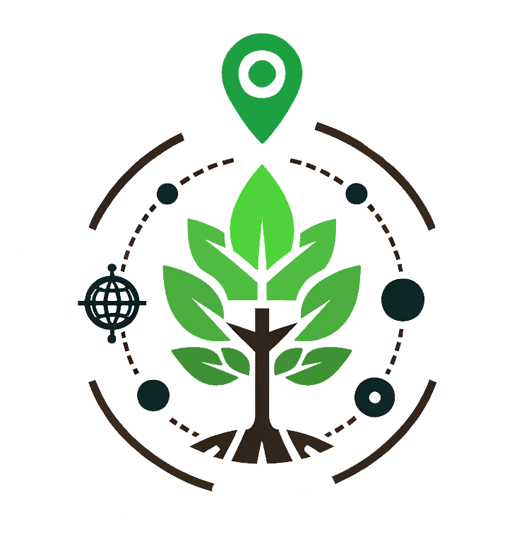  
  
</div>
  
1. [Introduction](#introduction)
2. [Configure Treechecker server](#server)
3. [Using the Treechecker App](#login)
    1. [Installing the Treechecker app on Android](#install)
    2. [Compass and GPS with an Android Device](#GPS)
    3. [Add an Area of Interest (AOI)](#aoi)
    4. [Add observations](#addobs)
    5. [Upload observations](#uploadobs)
    6. [Download observations](#dldobs)

4. [Developer documentation](#technical)  
    1. [Development environment set up](#devenv)
    2. [Build APK](#buildapk)


# Introduction <a name="introduction"></a>

The Treechecker app (and server) is an Android app enabling tree survey using offline maps. When online, the app first downloads WMS tiles (From a WMS layer of the user’s choice) on the Android device. It is then possible to visualize the layer offline while overlaying the location provided by the GPS of the Android device. When online, the app will upload the observations made on the field back to the Treechecker server.  

To use the Treechecker app you will need to set up and configure a Treechecker server. If you have not already set up your own Treechecker server then please go to chapter “How to set up a new Treechecker-server on Pythonanywhere” at [Treechecker-server](https://phipier.github.io/Treechecker-server/#installation1)  (For the BTSF training, a server will already be set up and ready to use.)

# Configure Treechecker server <a name="server"></a>
Before using the Treechecker App you will need to configure the Treechecker server by adding at least one Region of Interest.	

| | |
|---|---|
| 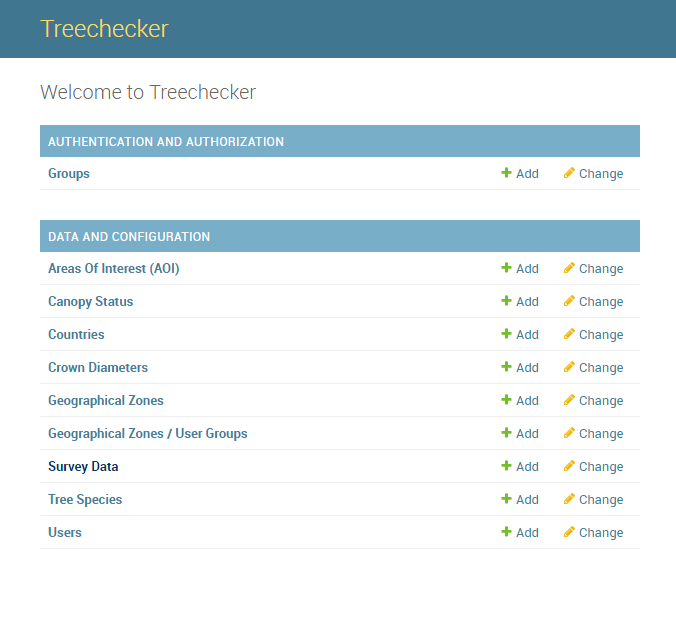|Navigate to the Treechecker server admin page (e.g. if you set up a Treechecker server using the Pythonanywhere service, the URL should be: your-username.pythonanywhere.com/config ). If you have not yet set up a Treechecker server, go to ... |
| 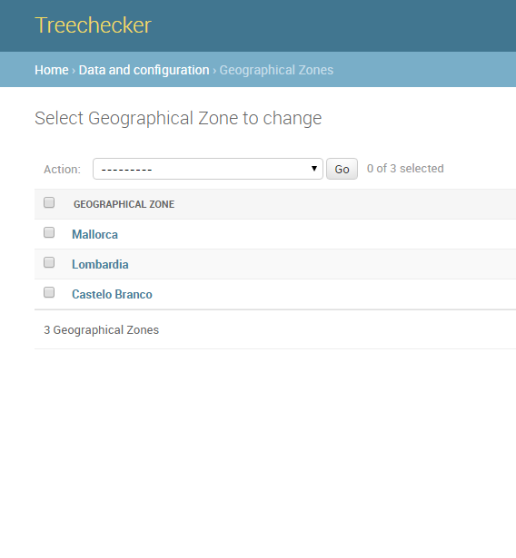|By clicking on “Geographical Zones”, the list of Geographical zones will appear. Click on button “Add Geographical Zone” at the top right-end corner of the screen.|
| |The Geographical Zone (same as Region of Interest) creation form will appear.|

The WMS layers information is stored as a JSON format string and splits into two parts:

* BASE_WMS : A list of Background layers (For now, these tiles are not downloaded onto the device, the layer is only visible at AOI creation time)
* DL_WMS : A list of WMS whose tiles will be downloaded when creating an area of interest (AOI) from the app.  

For example:
```
{  
"BASE_WMS":[  
    {  
        "name":"OSM",  
        "layerName":"OSM",  
        "url":"https://cartodb-basemaps-{s}.global.ssl.fastly.net/light_all/{z}/{x}/{y}.png",  
        "attribution":"Map data © <a href=\"http://openstreetmap.org\">OpenStreetMap</a> contributors",  
        "maxZoom":"22",  
        "maxNativeZoom":"19"  
    }  
],  
"DL_WMS":[  
    {  
        "name":"Lombardia",  
        "url":"https://www.cartografia.servizirl.it/viewer31/proxy/proxy.jsp?https://www.cartografia.servizirl.it/arcgis2/services/BaseMap/ortofoto2007UTM/ImageServer/WMSServer?",  
        "layers":"0",  
        "format":"image/png",  
        "transparent":"true",  
        "version":"1.1.0",  
        "height":256,  
        "width":256,  
        "crs":"EPSG:4326",  
        "maxZoom":"22",  
        "maxNativeZoom":"19"  
    }  
]  
}  
```
* Additional vector data
    
It is also possible to include additional features to be displaid on map. Only GeoJSON format is accepted.

For example:

```
[{
    "type": "LineString",
    "coordinates": [[9.7, 45.67], [9.8, 45.77], [9.9, 45.89]]
}, {
    "type": "LineString",
    "coordinates": [[8.7, 44.67], [8.8, 44.77], [8.9, 44.89]]
}]
```

# Using the Treechecker App <a name="login"></a>

## Installing the Treechecker app on Android <a name="install"></a>

* Download the Treechecker App (APK file) <a href="https://drive.google.com/file/d/122KjPJBneJ4AzPUuAEDSLZ1AkFTk3LYZ/view?usp=drive_link">here</a>. Allow Installation from Unknown Sources: Since the app is not being installed from the Google Play Store, your device may prompt you to allow installation from unknown sources.

* Install the App: Your device may display a warning indicating that the app's developer is unknown and ask for your confirmation to proceed with the installation. Select 'Install' to proceed. If you see any prompts regarding risks, choose 'Install anyway' if you trust the source.

After the installation is complete, you can open the app directly or find it listed with your other applications.

## Compass and GPS with an Android Device <a name="GPS"></a>

### Compass calibration

To be able to measure the compass heading, the device compass will need to be calibrated. You will find instructions on how to do it at the following link under "Calibrate your phone or tablet": https://support.google.com/maps/answer/2839911?co=GENIE.Platform%3DAndroid&hl=en  

### GPS

In order to use the Android device GPS efficiently, you may want to follow these recommendations:
* Geolocation should be set to "high precision" mode. For more information, please consult https://support.google.com/maps/answer/2839911?co=GENIE.Platform%3DAndroid&hl=en

* To save battery while using GPS, your device could be set to flight mode.

## Start the Treechecker App <a name="GPS"></a>

| | |
|---|---|
| |On your Android device, start the Treechecker App. |
| |On the login window, use the login and password created from the Treechecker server interface. Add the URL of your Treechecker server.|

By choosing the “stay offline” option, the app will not need an internet connection (e.g. when working on the field).  
In that case, you will be able to:

* Create and save observations on the device

You will NOT be able to:

* Update your Regions of Interest
* Create Areas of Interest (AOI)
* Upload your field observations to the Treechecker server
  
| | |
|---|---|
| 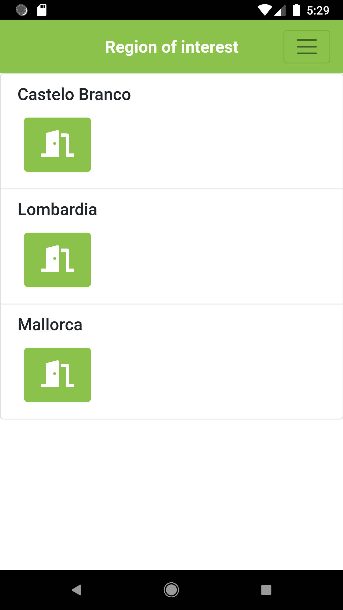|The next screen shows the list of regions of interest. |
| 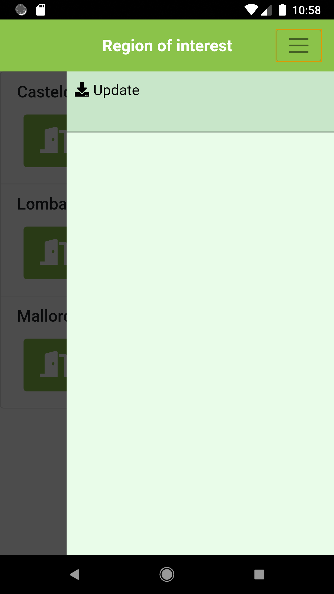|If nothing is displayed and you have already set up a region of interest from the Treechecker server interface, then click on the menu in the top right-end corner and push the update button (For this you will need to be online). This action will download the latest regions available and created earlier on the Treechecker server.|

Once you selected a region of interest, the next screen will display the list of areas of interest for that region.  

## Add an Area of Interest (AOI) <a name="aoi"></a>

To add an AOI, it is necessary to be online (WIFI or mobile data). From the AOI list, push the “+” button to access the AOI creation form.  

| | |
|---|---|
|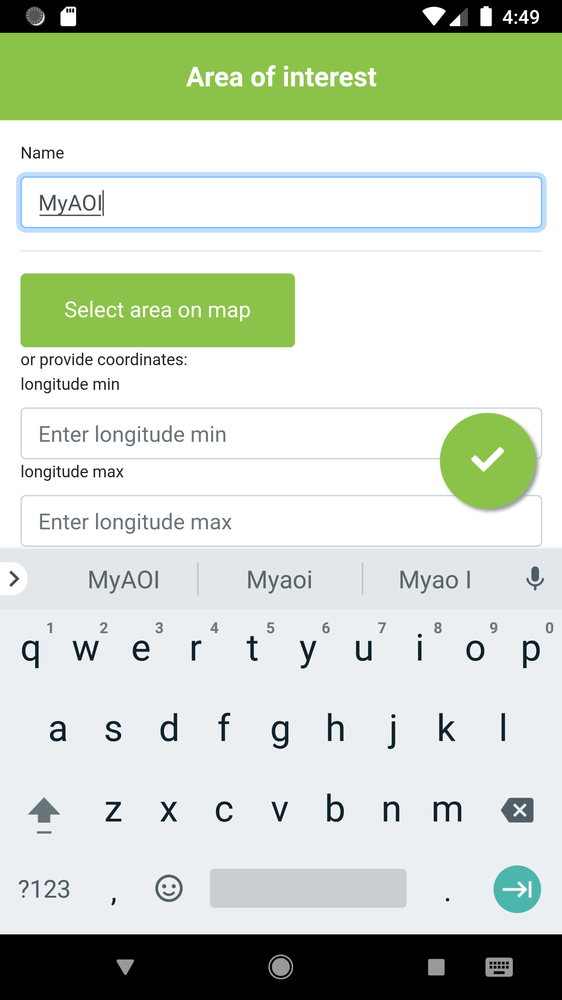|Give a name to your area of interest and push the “select area on the map” button to select the area where you will do your survey.|
||You can use the zoom (+/-) and pan the map to position the square on the area you selected. The app will later download all the layer tiles corresponding to the selected zone. Then navigate back to the AOI creation form using the right pointing arrow located on the bottom right corner.|
|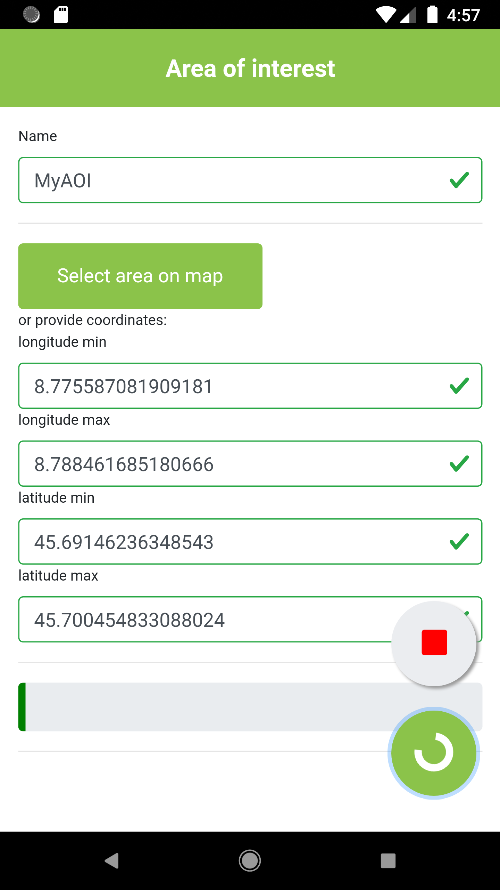|Push the button the “tick” button in the bottom right corner to save your AOI and start downloading the tiles corresponding to the area you have selected.  If the selected area is too large, you will have to reduce its size. It is possible to cancel the downloading process by clicking on the red square.|
|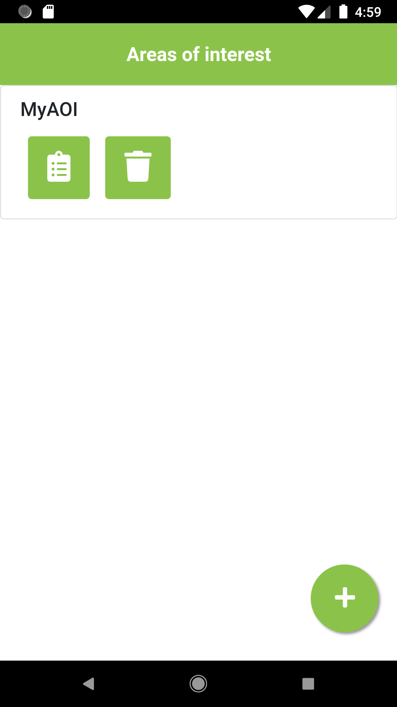|When the downloading process has completed, the application will navigate back to the AOI list that will include the newly created AOI. For each AOI (Area of interest) in the list, there are two buttons. One to access the observations section and another one to delete the AOI. If you use the push button for an AOI that has not yet uploaded observations, there will be a warning.|

## Add observations <a name="addobs"></a>

| | |
|---|---|
|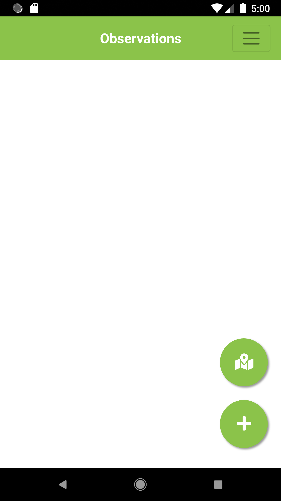|From the AOI list, select an AOI and push the observation button. The next screen will display the list of observations for the selected AOI. Push the “+” button to add an observation.|
||The next screen will show the map on which to locate the observation. You may navigate the map (zoom/pan) and then click on the position of your observation.|
||Another option is to turn on the GPS (top left button on the map) in order to let the map position itself and add a marker at your location (you will also have to set the GPS on your phone). You may adjust the marker location (push-drag-drop). The circle located around the marker symbolizes the GPS location accuracy.|

N.B: Android defines horizontal accuracy as the radius of 68% confidence. In other words, if you draw a circle centered at this location's latitude and longitude, and with a radius equal to the accuracy, then there is a 68% probability that the true location is inside the circle. This accuracy estimation is only concerned with horizontal accuracy, and does not indicate the accuracy of bearing (For more information about the GPS accuracy please go to https://developer.android.com/reference/android/location/Location.html#getAccuracy() )

After pushing the ‘next’ arrow, the observation form will appear.

| | |
|---|---|
|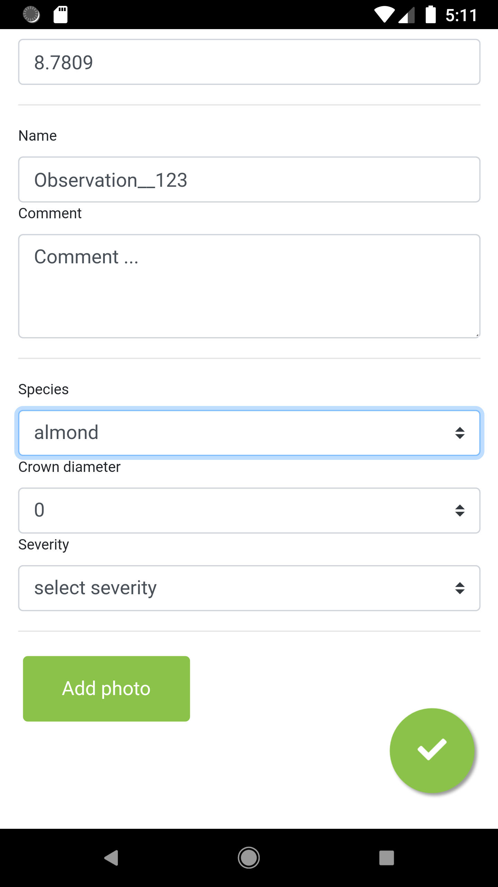|From the AOI list, select an AOI and push the observation button. The next screen will display the list of observations for the selected AOI. Push the “+” button to add an observation.|
|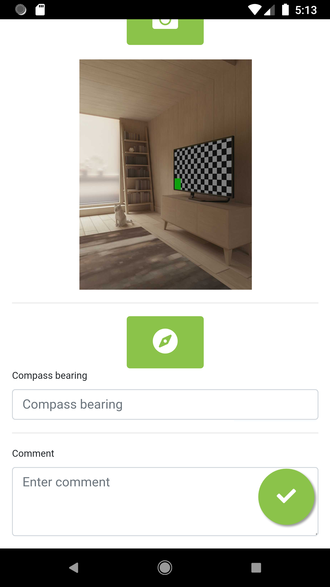|You may add pictures from your smartphone camera by clicking on the “Add photo” button. The photo form will appear and you will be able to take a picture by pushing the camera button.|
||You may add pictures from your smartphone camera by clicking on the “Add photo” button. The photo form will appear and you will be able to take a picture by pushing the camera button.
You may also add a bearing measure from the compass of your smartphone. For a matter of accuracy, you will position your smartphone horizontally and point the top part of your smartphone towards the subject of the photo you have taken. The compass bearing will then give the angle of the observer in respect to the magnetic North. You may also add a comment for the photo.|
||The next screen will take you back to the observation form. After validation of the observation form you will navigate back to the observation list. By pushing the map button, you will get an overall view of the observations that have been made fot that AOI so far.|

## Uploading observations to the Treechecker server <a name="uploadobs"></a>

| | |
|---|---|
|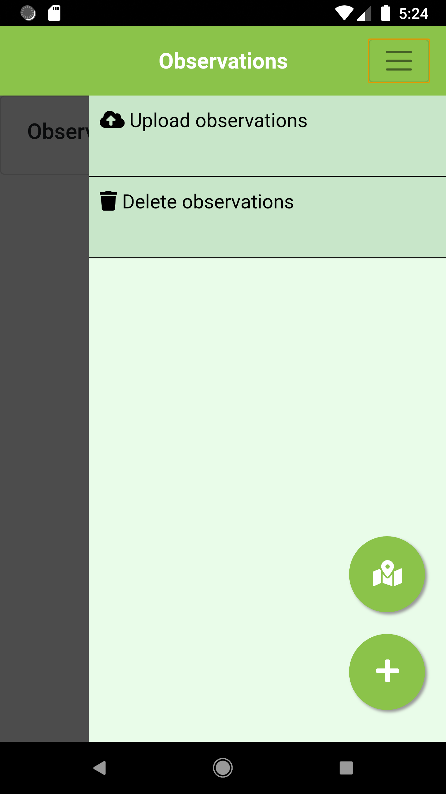|To upload observations, your device will need to be online. From the observation list, open the menu (top right corner) and push on “Upload observations". It is also possible to share survey data as a GeoJSON file.|
|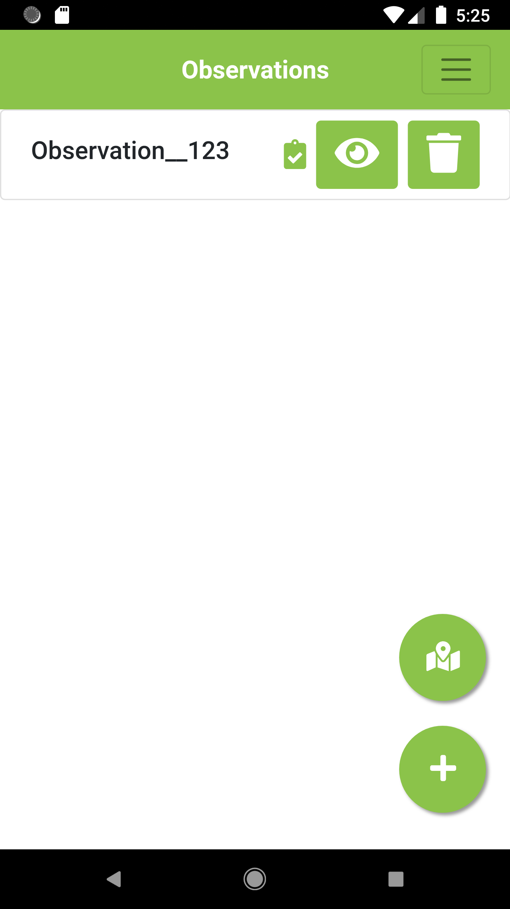|After the uploading process has completed, the uploaded observations will be marked as such in the observation list.|

## Downloading the field observation data <a name="dldobs"></a>

| | |
|---|---|
||Navigate to the Treechecker server admin page (e.g. if you set up a server using the Pythonanywhere service, your URL is: your-username.pythonanywhere.com/config). To visualize the list of observations previously uploaded to the Treechecker server, click on “Survey Data”.|
|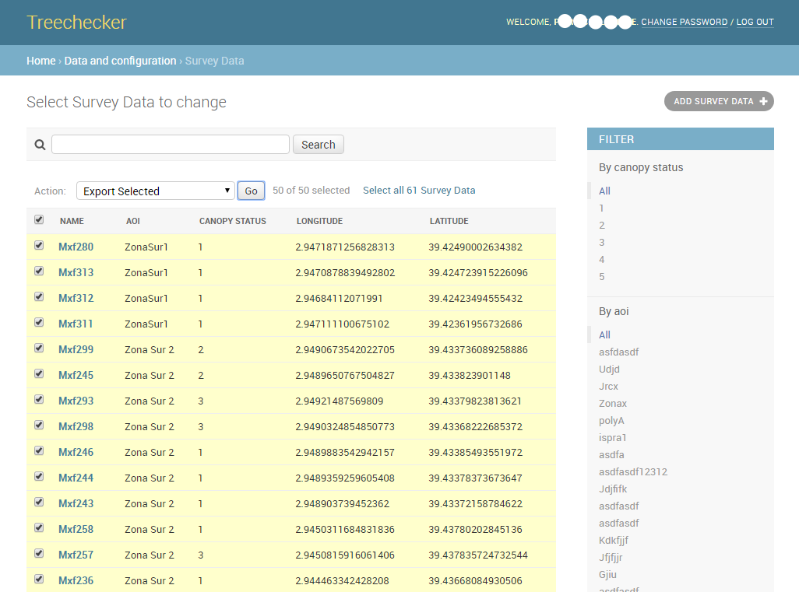|From the survey data page, it is possible to download the observation data by first selecting the data you would like to download and then selecting “Export selected” in the Action dropdown list. By clicking the “Go” button, it will create a file containing all the data selected and will download to your computer. Formats available are GeoJSON, GeoPackage and CSV|
|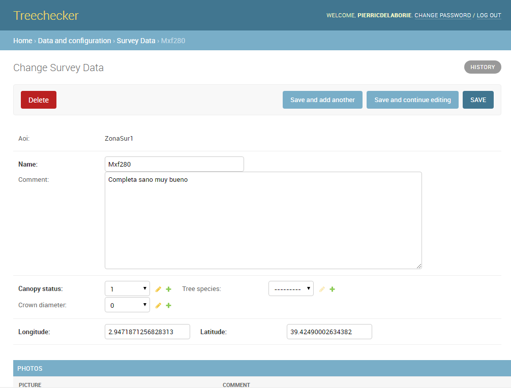|By clicking on a specific observation, it will display its information details. You can visualize individual observation.|
|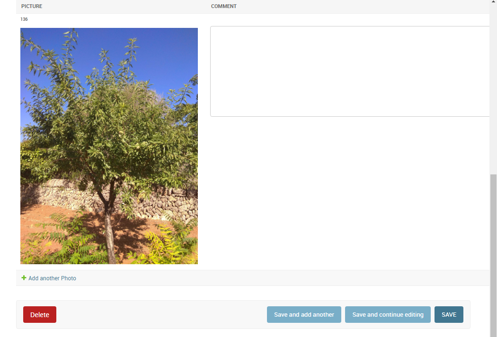|and pictures.|


# Technical documentation <a name="technical"></a>

## Development environment setup <a name="devenv"></a>

The Treechecker App is an Apache Cordova application. To set up a development environment, the following applications should be installed: 
* Java 
* npm  
* Cordova  
* Android Studio  

### Manual setup <a name="devenv"></a>
Here are the detailed steps for the setup of a development environment on a Linux machine (Debian)

#### 1. Install Node.js, npm and Cordova
Cordova requires Node.js and npm (Node Package Manager).
```
sudo apt update
sudo apt install nodejs npm
```
Install Cordova using npm:
```
npm install -g cordova
```
#### 2. Install Java Development Kit (JDK)
Android development requires JDK. Install OpenJDK using the following command:
```
sudo apt install openjdk-11-jdk
java --version
```
#### 4. Install Android Studio
Android Studio provides the Android SDK and emulator system you'll need for development.

Download Android Studio from the official site.
Extract the downloaded archive to a directory of your choice (e.g., /opt or your home directory).
Run the studio.sh script from the bin directory to start the installer.

#### 5. Set Environment Variables
You need to set JAVA_HOME and ANDROID_SDK_ROOT environment variables:

For JAVA_HOME, add this to your .bashrc or .profile file:
```
export JAVA_HOME=/usr/lib/jvm/java-11-openjdk-amd64
```
After installing Android Studio, you should set ANDROID_SDK_ROOT. This path might vary depending on where you installed Android Studio and the SDK. A common path is ~/Android/Sdk. Add this to your .bashrc or .profile file:
```
export ANDROID_SDK_ROOT=~/Android/Sdk
export ANDROID_HOME=~/Android/Sdk
export PATH=$PATH:$ANDROID_SDK_ROOT/emulator
export PATH=$PATH:$ANDROID_SDK_ROOT/tools
export PATH=$PATH:$ANDROID_SDK_ROOT/tools/bin
export PATH=$PATH:$ANDROID_SDK_ROOT/platform-tools
```
After adding these lines, apply the changes by running source ~/.bashrc or reopening your terminal.

#### 6. Install Android Platform Tools and Platforms
Using the SDK Manager in Android Studio, install:

Android SDK Platform-tools
Build-tools
Any platforms (API levels) you intend to develop for, under SDK Platforms (e.g., Android 11.0 (R)).

#### 7. Install ADB on Your Computer
To test the app directly on a USB connected device, ADB needs to be installed. If using a AVD (Android Virtual Device) in Android Studio or another Android emulator, then it is not necessary

Install ADB:
```
sudo apt update
sudo apt install adb
```

### Setup using a Docker image 

Another option is to use a Docker image that includes all previously listed softwares.

search for a cordova image
```
docker search cordova
```
Possible image to use, download image
```
docker pull beevelop/cordova
```

Go to the Treechecker project directory and then, 
```
sudo docker run -i -v /$PWD:/workspace -w /workspace --privileged beevelop/cordova
```

## Build APK <a name="buildapk"></a>

* Create the Android platform

```
$cordova platform add Android
```

After changing code in the app, a new APK needs to be built. On your development machine, go to project folder and run:

```
$cordova platform remove android

$cordova platform add android

$bash buildrel (for a release build)

$bash builddebug (for a debug build)
```

To see what platforms are available 
```
cordova platform list
```

To add the platform android
```
cordova platform add android
```

Connect device to computer

To build the app
```
cordova build
```
Then, in order to list the attached devices:
```
adb devices
```
to run android
```
cordova run android
```
to debug application, open chrome and go to chrome://inspect/#devices

To remove and add plugins
```
cordova plugin rm cordova-plugin-camera 
cordova plugin add cordova-plugin-camera 
```
To create release APK
```
bash buildrel
```
